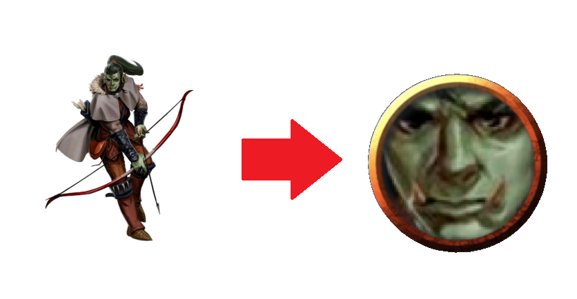

# Tokenator

Tokenator is a server made for creating virtual tabletop tokens from artwork, using a facial detection model specifically trained to work on artwork (most models are trained on photographs of real people).


# Usage
```sh
# Start the server (can also be deployed on Google app engine).
> python main.py

# HTTP POST your image to /create_token, port 8080 is the default.
> curl -F "image=@/path/to/your/image.png" localhost:8080/create_token
```

The server will respond with an image cropped around the highest confidence match for a face that it has found:

